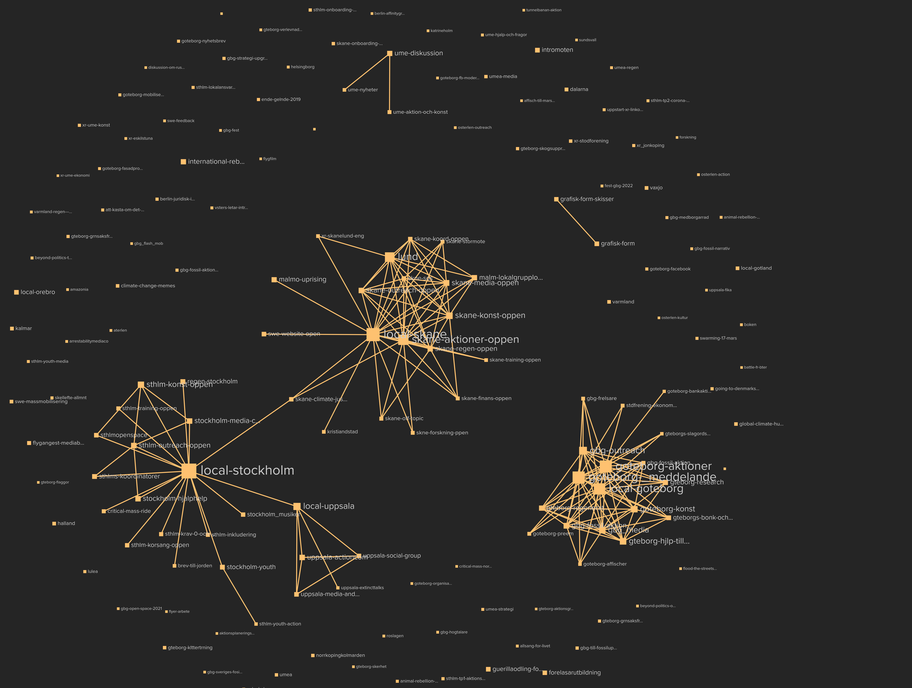

- [Mattermost user co-locations](#mattermost-user-co-locations)
  * [Dependencies](#dependencies)
  * [Usage](#usage)
    + [Fetch data from Mattermost](#fetch-data-from-mattermost)
    + [Process data](#process-data)
    + [Upload to kumu](#upload-to-kumu)
  * [Known issues](#known-issues)

# Mattermost user co-locations

Extract channel member co-locations from mattermost in a format kumu.io can ingest.

## Dependencies

If you have nix you can simply `nix-shell` to get the needed dependencies. The dependencies are:
 * Golang
 * A common lisp implementation (I've used sbcl) with asdf, alexandria and jzon availible

## Usage

### Fetch data from Mattermost

This command will fetch the needed data from mattermost and put it in `data.json`

`LOGIN_ID="<email/username>" LOGIN_PASSWORD="<password>" MATTERMOST_SERVER="https://mmserver.com" go run fetch.go | tail -n 1 - > data.json`

> NOTE: The specified user will attempt to join all public channels

### Process data

Enter the sbcl repl

`sbcl` (all further commands prefixed with `sbcl>` should be run the the sbcl repl)

Load `kneed.lisp`

`sbcl> (load "kneed.lisp")`

Output the channels as kumu nodes to `elements.csv`

`sbcl> (write-file #p"./elements.csv" (channels-to-kumu-elements-csv (channels)))`

Output the co-locations as kumu edges to `connections.csv`

`sbcl> (write-file #p"./connections.csv" (channels-co-locations-to-kumu-connections-csv (colocs)))`

It's probably usefull to filter some of the co-locaitons, there will likely be a huge amount of edges with a single co-locaiton. To filter co-locations `filter-co-locations` can be used

`sbcl> (write-file #p"./connections_filtered.csv" (channels-co-locations-to-kumu-connections-csv (filter-co-locations (channels) (colocs) 0.5 20)))`

will write only the co-locations where both of the nodes contains at least 20 members and the co-locations amount to at least 50% of the members of one of the groups.

### Upload to kumu

The generated `.csv` files will be recognized by kumu, you can simply import them.

## Known issues

 * This is a very 80/20 project, no polished by any means. Please don't hessitate to send me a message if you actually want to use this but can't manage to.
 * Overwriting existing files doesn't appear to work. You might have to remove a file before overwriting
